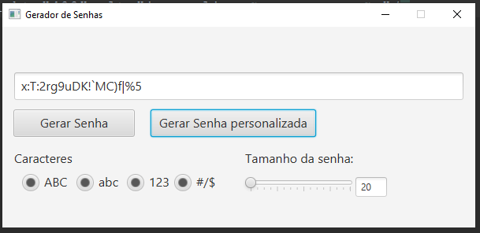

# Gerador-de-Senhas

## Descrição
atualmente esta cada veis mais deficio criar senhas letras, numeros, caracteres especias  alem de senhas com mais de 6 digitos fica cada difico criar uma senha de cabesa.
meu objetivo nesse projeto não e cria um projeto visualmente bonito mais sim simples e pratico.

## Recomendação de uso

crie senhas sempre com 8 ou mais caracteres evite utilizar somente letras ou numeros amesnos que seja nesesario.

## Como Executar o Projeto

1. **Crie um novo projeto Java**: Use a IDE de sua escolha.
2. **Substitua a pasta `src`**: Navegue até a pasta `src` do seu projeto e substitua-a pelo `src` deste repositório.
3. **Compile e execute o código**.
